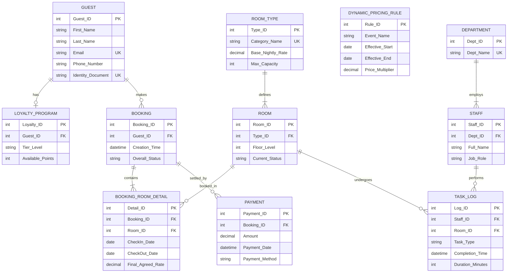

# Phase 1: 酒店预订与管理系统数据库建模与设计报告

## 1. 建模演进概述：从“初版草案”到“企业级 PMS”

通过对 `@初版草案.jpg` 和 `@数据库需求清单生成指南.docx` 的深度解析，我们发现初版草案搭建了基础的业务骨架，但存在明显的数据冗余和规范化缺陷（如 `LOG` 表耦合了预订、明细与财务；`ROOM` 表未对房型进行抽象；多对多关系处理简单）。

本阶段建模在吸收初版核心思想（客房、客户、管理人员）的基础上，严格按照《生成指南》的要求，引入了关联实体、三元关系、动态定价和忠诚度计划，完成了向**现代化、企业级酒店物业管理系统 (PMS)** 的全面升级。

## 2. 概念模型设计 (EER Diagram)

以下是使用 Mermaid 语法构建的高级实体关系图 (EER Diagram)，展示了核心实体的复杂交互。

## 3. 逻辑架构与关系模式定义

以下为升级后的核心关系模式（Relations），已标明主键 (PK)、外键 (FK) 及关键约束。

### 3.1 客户与忠诚度域
*   **Guest** (<ins>Guest_ID</ins>, First_Name, Last_Name, Email, Phone_Number, Identity_Document, Personal_Prefs)
*   **Loyalty_Program** (<ins>Loyalty_ID</ins>, *Guest_ID*, Tier_Level, Available_Points, Enrollment_Date)

### 3.2 客房与库存域 (重构了草案中的 ROOM 表)
*   **Room_Type** (<ins>Type_ID</ins>, Category_Name, Base_Nightly_Rate, Max_Capacity)
*   **Room** (<ins>Room_ID</ins>, *Type_ID*, Floor_Level, Current_Status)

### 3.3 预订与交易域 (重构了草案中的 LOG 表)
*   **Booking** (<ins>Booking_ID</ins>, *Guest_ID*, Creation_Time, Total_Guests, Overall_Status)
*   **Booking_Room_Detail** (<ins>Detail_ID</ins>, *Booking_ID*, *Room_ID*, CheckIn_Date, CheckOut_Date, Final_Agreed_Rate)
    *   *说明：引入关联实体消除了 Booking 和 Room 之间的多对多关系。*
*   **Payment** (<ins>Payment_ID</ins>, *Booking_ID*, Amount, Payment_Date, Payment_Method, Status)

### 3.4 动态定价域 (新增创新点)
*   **Dynamic_Pricing_Rule** (<ins>Rule_ID</ins>, Event_Name, Effective_Start, Effective_End, Price_Multiplier)

### 3.5 部门与任务域 (重构了草案中的 Manager, Management, Reference)
*   **Department** (<ins>Dept_ID</ins>, Dept_Name)
*   **Staff** (<ins>Staff_ID</ins>, *Dept_ID*, Full_Name, Job_Role)
*   **Task_Log** (<ins>Log_ID</ins>, *Staff_ID*, *Room_ID*, Task_Type, Completion_Time, Duration_Minutes, Quality_Score)
    *   *说明：使用三元关系 (Staff, Room, Task_Type) 精准记录“谁在哪个房间做了什么事耗时多久”。*

## 4. 规范化验证 (Normalization to 3NF)

为确保数据库达到市场顶级性能与数据一致性，我们对核心表进行了严格的范式推演：

1.  **第一范式 (1NF)**：所有列必须是原子性的。
    *   *草案痛点*：草案中的 `LOG` 表试图在一个记录中存放复杂的订单时间、多个房间分配以及支付情况，极易产生嵌套重复组。
    *   *优化*：我们拆分出了 `Booking`、`Booking_Room_Detail` 和 `Payment`。每个表每一列都是不可再分的标量（如拆分出 `CheckIn_Date` 和 `CheckOut_Date`），彻底满足 1NF。
2.  **第二范式 (2NF)**：消除非主属性对部分主键的依赖。
    *   *草案痛点*：草案的 `ROOM (roomNo, price, roomType)` 中，`price` 实际上依赖于 `roomType` 而非物理的 `roomNo`。
    *   *优化*：抽离出 `Room_Type (Type_ID, Base_Nightly_Rate)`，`Room` 表通过 `Type_ID` 外键关联。此时 `Room` 表中的 `Floor_Level` 完全依赖于 `Room_ID`，满足 2NF，防止了批量修改价格时产生的更新异常。
3.  **第三范式 (3NF)**：消除非主属性之间的传递依赖。
    *   *草案痛点*：如果 `LOG` 表中同时包含 `Gid`（客户ID）和客户的支付余额，或者在财务表中冗余存储客户姓名。
    *   *优化*：在最终的 `Payment` 表中，只保留 `Booking_ID` 外键。客户信息（如姓名）完全在 `Guest` 表中维护。`Payment -> Booking_ID -> Guest_ID` 的路径通过 JOIN 实时查询，杜绝了传递依赖，完美符合 3NF。

## 5. 创新性与附加需求落地

本建模方案完全满足了 EBU5503 场景二的基础要求，并通过以下设计达成顶级标准：
1.  **时间序列动态定价支持**：`Dynamic_Pricing_Rule` 表与 `Booking_Room_Detail.Final_Agreed_Rate` 的结合，为未来 AI 定价 Agent 的接入提供了完美的底层数据结构。
2.  **三元关系任务追踪**：打破了简单的“人-房”关联，`Task_Log` 赋予了劳动力调度数据颗粒度，支持后续的效能分析（KPI）。
3.  **高并发下的库存解耦**：不依赖简单的“客房状态”来判断是否可预订，而是通过 `Booking_Room_Detail` 中的时间段交集（Date Overlap）查询，从根本上防止了超售。
